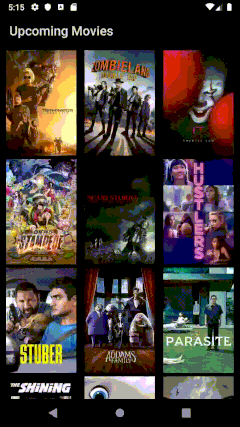

# The Movie Database (TMDB) - Android - Clean Architecture - Kotlin

This repo uses the principles of Clean Architecture and it's inspired by Fernando Cejas' repo (https://github.com/android10/Android-CleanArchitecture-Kotlin).
Although it uses Fernando's project structure, it has a different source of data: The Movie Database (TMDB) web services.

## Additional info:
* Language: Kotlin
* UI Layer: MVVM
* Data Layer: Repository
* Dependecy Injection: Dagger2
* Http Requests: Retrofit2
* Async requests: Coroutines

For running the app, an api key must be created at TMDB website: https://developers.themoviedb.org/3
Then, put it inside ApplicationModule.kt.

`​`​`kotlin
com.barca.tmdb.core.di.ApplicationModule
`​`​`

`​`​`kotlin
val okHttpClientBuilder: OkHttpClient.Builder = OkHttpClient.Builder()
                .addInterceptor {
                    val request = it.request()
                    val newUrl = request.url().newBuilder()
                            .addQueryParameter("api_key", "`YOUR_API_KEY`")
                            .build()
                    it.proceed(
                            request.newBuilder()
                                    .url(newUrl)
                                    .build())
                }
`​`​`

## Sample app

